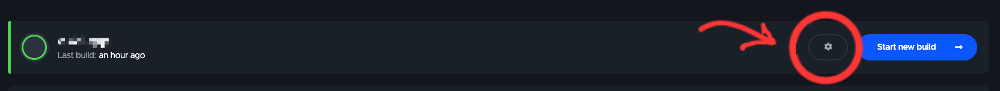
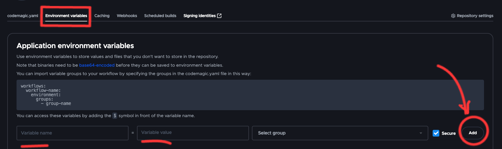
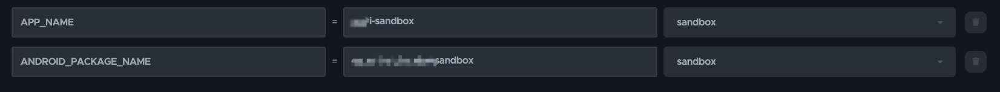

# White-labeling a Flutter Application with Codemagic

## What is White-labeling in Codemagic?

White-labeling is the process of customizing an application's branding and appearance to match different clients or brands. With Codemagic, you can easily create white-labeled versions of your Flutter application by leveraging variables and configurations.

## Step 1: Adding Variables in Codemagic and Setting the White-label Group

To customize your application for white-labeling, you need to add variables in the Codemagic dashboard. These variables will allow you to change the app icon, package name in Android, bundle identifier for iOS, and other configurations. In addition, you can set a white-label group to organize your white-labeled versions.



1. Open the Codemagic dashboard and navigate to your project.
2. Go to the "Environment" section and click on "Add Variable".
3. Add variables for the specific configurations you want to customize, such as `packageName`, `appName`, `bundleIdentifier`, or `firebaseConfigFile`.
4. Save the variables.
5. To set the white-label group, add a variable named `APP_NAME` and set its value to the desired app name.
6. Save the variable.





## Step 2: Create the codemagic.yaml File

To configure Codemagic for your Flutter project, you need to create a `codemagic.yaml` file in the root directory of your project. This file will contain the necessary configuration settings for building your app on Codemagic.

Follow these steps to create the `codemagic.yaml` file:

1. Open your project in a text editor.
2. Create a new file in the root directory of your project.
3. Name the file `codemagic.yaml`.
4. Add the necessary configuration settings for Android and iOS platforms.

- Specify the target group for your app.
- Choose the machine on which you want to build your Flutter app.
- Add any other required configuration settings.

Here's an example of how the `codemagic.yaml` file might look:

Android:

```yaml
name: Android client release
instance_type: mac_mini_m1
environment:
  flutter: 3.13.7
  groups:
    - sandbox
```

iOS:

```yaml
ios-client-release:
  name: iOS client release
  instance_type: mac_mini_m1
  environment:
    groups:
      - sandbox
    vars:
      XCODE_SCHEME: "Runner"
```

## Step 3: Change App Name

To change the app name in Android and iOS, you can use the following scripts:

Android:

```yaml
- name: Change package name
  script: |
    flutter pub add rename
    dart pub global activate rename
    rename setAppName --targets ios,android --value $APP_NAME
```

iOS:

```yaml
- name: Change iOS app name
  script: |
    echo "Change iOS app name to $APP_NAME"
    /usr/libexec/PlistBuddy -c "Set :CFBundleName $APP_NAME" -c "Set :CFBundleDisplayName $APP_NAME" ios/${XCODE_SCHEME}/Info.plist
```

as we mentioned before we defined the $APP_NAME in valirable sections.

## Step 4: Change App PackageName Or BundleIdentifier

To change the app packageName in Android or BundleIdentifier iOS, you can use the following scripts:

Android:

```yaml
- name: Change package name
  script: |
    rename setBundleId --targets android --value $ANDROID_PACKAGE_NAME
```

iOS:

```yaml
- name: Set bundle id
  script: |
    echo "Change iOS Bundle Id to $IOS_BUNDLE_ID"
    sed -i '' -e 's/PRODUCT_BUNDLE_IDENTIFIER \= [^\;]*\;/PRODUCT_BUNDLE_IDENTIFIER = '${IOS_BUNDLE_ID}';/' ios/${XCODE_SCHEME}.xcodeproj/project.pbxproj
```

## Step 5: Change Projects Assets

This step is same for Andoird and IOS

```yaml
- name: Download and unzip assets
  script: |
    echo "Downloading assets from $ASSETS_URL"
    curl -O $ASSETS_URL || echo "Failed to download assets"
    echo "Unzipping assets.zip"
    unzip -o assets.zip || echo "Failed to unzip assets.zip"
```

## Step 6: Firebase Configuration

In this step we configure Firebase and download firebase config files for ANdroid and iOS:

Android:

```yaml
- name: Download and unzip Android Google service json file
  script: |
    echo "Downloading firebase from $ANDROID_FIREBASE"
    curl -O $ANDROID_FIREBASE || echo "Failed to download google-service"
    echo "Unzipping google-service.zip"
    unzip -o doki-sandbox-android.zip -d android/app || echo "Failed to unzip google-service.zip"
```

iOS:

```yaml
- name: Download and unzip GoogleService-Info.plist file
  script: |
    echo "Downloading firebase from $IOS_FIREBASE"
    curl -O $IOS_FIREBASE || echo "Failed to download GoogleService-Info"
    echo "Unzipping GoogleService-Info.zip"
    unzip -o doki-sandbox-android.zip -d ios/Runner || echo "Failed to unzip GoogleService-Info.zip"
```

## Step 7: Change App Icon

Next, We can change the app icon with this script

Android:

```yaml
- name: Download and unzip Android App Icon
  script: |
    echo "Downloading icon from $ANDROID_ICON"
    curl -O $ANDROID_ICON || echo "Failed to download res.zip"
    echo "Unzipping res.zip"
    unzip -o res.zip -d android/app/src/main || echo "Failed to unzip res.zip"
```

iOS:

```yaml
- name: Download and unzip Android App Icon
  script: |
    echo "Downloading icon from $IOS_ICON"
    curl -O $IOS_ICON || echo "Failed to download Assets.xcassets.zip"
    echo "Unzipping Assets.xcassets.zip"
    unzip -o Assets.xcassets.zip -d ios/Runner || echo "Failed to unzip Assets.xcassets.zip"
```

After Step 7, we have some specefic steps for Android and iOS:

## Step 8 (Android): Sign Android build

To sign the Android build, we first need to encode the `key.jks` and `key.properties` files on your local machine. This can be achieved using the following commands:

```bash
openssl base64 -in key.jks -out jksEncoded.txt
openssl base64 -in key.properties -out keyEncoded.txt
```

Note: Ensure that you execute these commands in the same directory where key.properties and key.jks are located.

Executing these commands will generate encoded text for key.jks and key.properties. This encoded text should then be added to your Codemagic environment variables.

Android:

```yaml
- name: Decode Keystore and Properties
  script: |
    echo "$KEYSTORE" | base64 --decode > ./android/app/doki.jks
    echo "$KEY_PROPERTIES" | base64 --decode > ./android/key.properties
```

Ensure that `$KEYSTORE` corresponds to your encoded `key.jks` file and `$KEY_PROPERTIES` corresponds to your encoded `key.properties` file. Verify that these variables have been correctly added to your Codemagic dashboard.

## Step 9 (Android): Install Dependencies And Gradle

In this section of the workflow, we are installing the necessary dependencies for our project. The `flutter packages pub get` command fetches the Flutter packages needed for the project. We then navigate into the Android directory and run the Gradle wrapper command to ensure the correct Gradle version is used. Finally, we navigate back to the project root.

```yaml
- name: Install dependencies
  script: |
    flutter packages pub get 
    cd android && ./gradlew wrapper --gradle-version 7.4 --distribution-type all
    cd ..
```

Please replace `7.4` with the specific version of Gradle that your project requires.

## Step 10 (Adnroid): Build Android APk Or ABB

In this step, we will build the Android APK. The `flutter build apk --split-per-abi` command is used to build an APK file that is split by ABI. This results in smaller APK files that users download, which is particularly useful if your app supports multiple ABIs.

```yaml
- name: Flutter build after package name change
  script: |
    flutter build apk --split-per-abi
```

Good! You've done white-labeling for Android. See the final codmagic.yaml in the end of this document.

## Step 8 (iOS): Install Dependencies Via POD

We make sure the iOS dependencies already installed

```yaml
- name: Install pods
  script: find . -name "Podfile" -execdir pod install \;
```

## Step 9 (iOS): Sign iOS

Now, we sign the flutter project for iOS with this script:

```yaml
- name: iOS code signing
  script: |
    keychain initialize
    app-store-connect fetch-signing-files "$IOS_BUNDLE_ID" --type IOS_APP_STORE --create
    keychain add-certificates
    xcode-project use-profiles
```

## Step 10 (iOS): Build iOS IPA

In the last step, we run pub get to get all packages and then build ipa:

```yaml
- name: Install dependencies
  script: flutter packages pub get

- name: Flutter build ipa and automatic versioning
  script: |
    flutter build ipa --release --export-options-plist /Users/builder/export_options.plist
```

Here is the final codemagic.yaml file:

```yaml
workflows:
  android-client-release:
    name: Android client release
    instance_type: mac_mini_m1
    environment:
      flutter: 3.13.7
      groups:
        - sandbox
    scripts:
      - name: Change package name
        script: |
          flutter pub add rename
          dart pub global activate rename
          rename setBundleId --targets android --value $ANDROID_PACKAGE_NAME

      - name: Change Android app name
        script: rename setAppName --targets ios,android --value $APP_NAME

      - name: Download and unzip assets
        script: |
          echo "Downloading assets from $ASSETS_URL"
          curl -O $ASSETS_URL || echo "Failed to download assets"
          echo "Unzipping assets.zip"
          unzip -o assets.zip || echo "Failed to unzip assets.zip"

      - name: Download and unzip Android Google service json file
        script: |
          echo "Downloading firebase from $ANDROID_FIREBASE"
          curl -O $ANDROID_FIREBASE || echo "Failed to download google-service"
          echo "Unzipping google-service.zip"
          unzip -o doki-sandbox-android.zip -d android/app || echo "Failed to unzip google-service.zip"

      - name: Download and unzip Android App Icon
        script: |
          echo "Downloading icon from $ANDROID_ICON"
          curl -O $ANDROID_ICON || echo "Failed to download res.zip"
          echo "Unzipping res.zip"
          unzip -o res.zip -d android/app/src/main || echo "Failed to unzip res.zip"

      - name: Decode Keystore and Properties
        script: |
          echo "$KEYSTORE" | base64 --decode > ./android/app/doki.jks
          echo "$KEY_PROPERTIES" | base64 --decode > ./android/key.properties

      - name: Install dependencies
        script: |
          flutter packages pub get 
          cd android && ./gradlew wrapper --gradle-version 7.4 --distribution-type all
          cd ..
      - name: Flutter build after package name change
        script: |
          flutter build apk --split-per-abi

    artifacts:
      - build/**/outputs/**/*.apk

  ios-client-release:
    name: iOS client release
    instance_type: mac_mini_m1
    environment:
      groups:
        - sandbox
      vars:
        XCODE_SCHEME: "Runner"
    scripts:
      - name: Change iOS app name
        script: |
          echo "Change iOS app name to $APP_NAME"
          /usr/libexec/PlistBuddy -c "Set :CFBundleName $APP_NAME" -c "Set :CFBundleDisplayName $APP_NAME" ios/${XCODE_SCHEME}/Info.plist

      - name: Set bundle id
        script: |
          echo "Change iOS Bundle Id to $IOS_BUNDLE_ID"
          sed -i '' -e 's/PRODUCT_BUNDLE_IDENTIFIER \= [^\;]*\;/PRODUCT_BUNDLE_IDENTIFIER = '${IOS_BUNDLE_ID}';/' ios/${XCODE_SCHEME}.xcodeproj/project.pbxproj

      - name: Change iOS icons
        script: |
          echo "Downloading icon from $IOS_ICON"
          curl -O $IOS_ICON || echo "Failed to download Assets.xcassets"
          echo "Unzipping Assets.xcassets.zip"
          unzip -o Assets.xcassets.zip -d ios/${XCODE_SCHEME}/Assets.xcassets/ || echo "Failed to unzip Assets.xcassets"

      - name: Download and unzip assets
        script: |
          echo "Downloading assets from $ASSETS_URL"
          curl -O $ASSETS_URL || echo "Failed to download assets"
          echo "Unzipping assets.zip"
          unzip -o assets.zip || echo "Failed to unzip assets.zip"

      - name: Install pods
        script: find . -name "Podfile" -execdir pod install \;

      - name: iOS code signing
        script: |
          keychain initialize
          app-store-connect fetch-signing-files "$IOS_BUNDLE_ID" --type IOS_APP_STORE --create
          keychain add-certificates
          xcode-project use-profiles

      - name: Install dependencies
        script: flutter packages pub get

      - name: Flutter build ipa and automatic versioning
        script: |
          flutter build ipa --release --export-options-plist /Users/builder/export_options.plist

    artifacts:
      - build/ios/ipa/*.ipa
# Document
# Make key.properties base64 with this command -> openssl base64 -in key.properties -out outName.txt
# Make doki.jks base64 with this command -> openssl base64 -in doki.jks -out jskOutName.txt
# make rsa CERTIFACE_KEY | ssh-keygen -t rsa -b 2048 -m PEM -f ~/Desktop/ios_distribution_private_key -q -N ""
```

# Conclusion

This concludes the setup and build process for white-label in flutter application. If you encounter any issues or have any questions, please open an issue in the GitHub repository. We appreciate your contribution to this project and look forward to working together to improve it.

## Authors:

<h4>
Amir Jabbari [ <a href="https://www.linkedin.com/in/amirjabbarii/">LinkedIn</a> ]
<br>
Mehran Shoghi [ <a href="https://www.linkedin.com/in/mehranshoghi">LinkedIn</a> ]
</h4>
